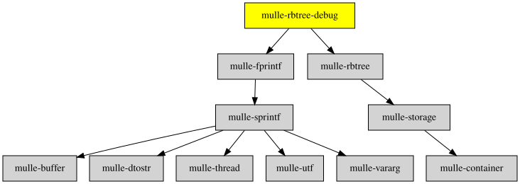

# mulle-rbtree-debug

#### 🍫 mulle-rbtree-debug organizes data in a red/black tree

This is debugging code for [mulle-rbtree](//github.com/mulle-c/mulle-rbtree)
and used mulle-fprintf, therefore residing in mulle-core.


| Release Version                                       | Release Notes  | AI Documentation
|-------------------------------------------------------|----------------|---------------
|  [](//github.com/mulle-core/mulle-rbtree-debug/actions) | [RELEASENOTES](RELEASENOTES.md) | [DeepWiki for mulle-rbtree-debug](https://deepwiki.com/mulle-core/mulle-rbtree-debug)


## Documentation & Guides

* [API Summary](asset/dox/api/toc)


### You are here




## Add

**This project is a component of the [mulle-core](//github.com/mulle-core/mulle-core) library. As such you usually will *not* add or install it
individually, unless you specifically do not want to link against
`mulle-core`.**


### Add as an individual component

Use [mulle-sde](//github.com/mulle-sde) to add mulle-rbtree-debug to your project:

``` sh
mulle-sde add github:mulle-core/mulle-rbtree-debug
```

To only add the sources of mulle-rbtree-debug with dependency
sources use [clib](https://github.com/clibs/clib):


``` sh
clib install --out src/mulle-core mulle-core/mulle-rbtree-debug
```

Add `-isystem src/mulle-core` to your `CFLAGS` and compile all the sources that were downloaded with your project.


## Install

Use [mulle-sde](//github.com/mulle-sde) to build and install mulle-rbtree-debug and all dependencies:

``` sh
mulle-sde install --prefix /usr/local \
   https://github.com/mulle-core/mulle-rbtree-debug/archive/latest.tar.gz
```

### Legacy Installation

Install the requirements:

| Requirements                                 | Description
|----------------------------------------------|-----------------------
| [mulle-rbtree](https://github.com/mulle-c/mulle-rbtree)             | 🍫 mulle-rbtree organizes data in a red/black tree
| [mulle-fprintf](https://github.com/mulle-core/mulle-fprintf)             | 🔢 mulle-fprintf marries mulle-sprintf to stdio.h

Download the latest [tar](https://github.com/mulle-core/mulle-rbtree-debug/archive/refs/tags/latest.tar.gz) or [zip](https://github.com/mulle-core/mulle-rbtree-debug/archive/refs/tags/latest.zip) archive and unpack it.

Install **mulle-rbtree-debug** into `/usr/local` with [cmake](https://cmake.org):

``` sh
PREFIX_DIR="/usr/local"
cmake -B build                               \
      -DMULLE_SDK_PATH="${PREFIX_DIR}"       \
      -DCMAKE_INSTALL_PREFIX="${PREFIX_DIR}" \
      -DCMAKE_PREFIX_PATH="${PREFIX_DIR}"    \
      -DCMAKE_BUILD_TYPE=Release &&
cmake --build build --config Release &&
cmake --install build --config Release
```


## Author

[Nat!](https://mulle-kybernetik.com/weblog) for Mulle kybernetiK  


